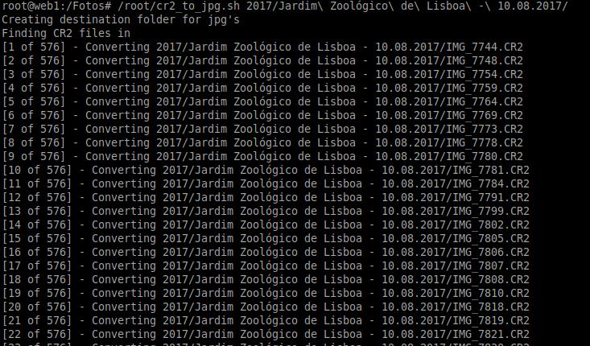

# CR2 to JPG converter script

This simple script will find all CR2 files in the folder you specify and will convert them to JPG at 80% quality into a folder called 'converted' inside the folder you specify.

## How to use it? Simple
`./cr2_to_jpg.sh folder-path`

## Whats next?
This is such a simple script that has no additional sanity checks.
Probably it could save a log of what was converted and what failed for future investigation..
Will have to add checks to see if the needed scripts exits.
